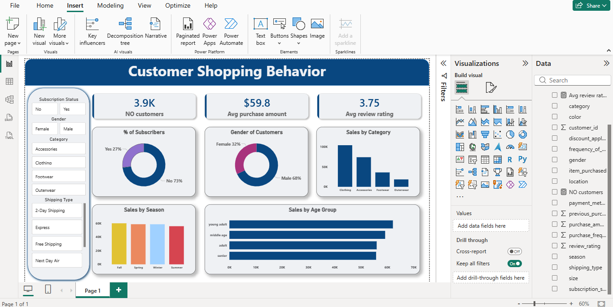

# Customer Shopping Behavior Analysis

## Project Overview

This project analyzes customer shopping behavior using transactional retail data to uncover spending patterns, customer segments, product preferences, and subscription trends. The analysis combines Python, PostgreSQL, and Power BI to transform raw customer data into actionable business insights and recommendations.

---

## Objectives

The project aims to:

- Understand customer purchasing behavior.
- Analyze revenue drivers and spending patterns.
- Evaluate subscription and discount usage.
- Segment customers based on purchase history.
- Identify high-performing products and categories.
- Support business decision-making through data-driven insights.

---

## Dataset Information

Dataset: Customer Shopping Behavior Dataset

Records: 3,900 transactions

Features Included:

- Customer demographics (Age, Gender, Location)
- Subscription status
- Product and category information
- Purchase amount
- Discounts and promotions
- Review ratings
- Shipping methods
- Purchase frequency and history

---

## Tools & Technologies

- Python
- Pandas
- PostgreSQL
- SQL
- Power BI

---

## Data Preparation & Cleaning

Data preprocessing was performed using Python and Pandas.

Key preparation steps included:

- Data exploration and validation
- Missing value handling for review ratings
- Column standardization using snake_case naming conventions
- Feature engineering for age groups
- Creation of purchase frequency metrics
- Data consistency checks and redundancy removal
- Loading cleaned data into PostgreSQL for analysis

---

## SQL Analysis

Business-focused SQL queries were developed to answer key questions, including:

- Revenue comparison by gender
- Subscriber vs. non-subscriber spending behavior
- Top-rated products analysis
- Shipping type impact on purchase amount
- Customer segmentation (New, Returning, Loyal)
- Revenue contribution by age group
- Discount dependency analysis
- Top-performing products by category
- Repeat buyer subscription analysis

---

## Dashboard Features

An interactive Power BI dashboard was developed to provide:

- Customer behavior analysis
- Revenue and spending insights
- Product performance tracking
- Subscription analysis
- Customer segmentation visualization
- Dynamic filtering and exploration

---

## Key Findings

- Customer spending behavior varies significantly across demographic groups.
- Subscribers contribute higher long-term business value compared to non-subscribers.
- Certain products rely heavily on discounts to drive purchases.
- Loyal and repeat customers represent a valuable revenue segment.
- Revenue contribution differs across age groups and purchasing patterns.
- Product ratings and purchase behavior provide useful indicators for marketing and product strategy.

---

## Business Recommendations

- Expand subscriber-focused promotions and benefits.
- Strengthen loyalty programs to increase customer retention.
- Optimize discount strategies to balance sales growth and profitability.
- Promote top-rated and high-performing products.
- Implement targeted marketing campaigns based on customer segments and demographics.

---

## Dashboard Preview

### Main Dashboard

---

## Skills Demonstrated

- Data Cleaning
- Data Transformation
- Feature Engineering
- Exploratory Data Analysis (EDA)
- SQL Query Development
- PostgreSQL
- Customer Segmentation
- Business Analysis
- Power BI Dashboard Development
- Data Visualization
- Business Insight Generation

---

## Future Improvements

- Predict customer churn using machine learning.
- Develop customer lifetime value (CLV) models.
- Build recommendation systems for personalized product suggestions.
- Create predictive sales and revenue forecasting models.

---

## Author
Esraa Bahaa

Developed as an end-to-end data analytics project covering data preparation, SQL analysis, business intelligence, dashboard development, and business recommendation generation.
